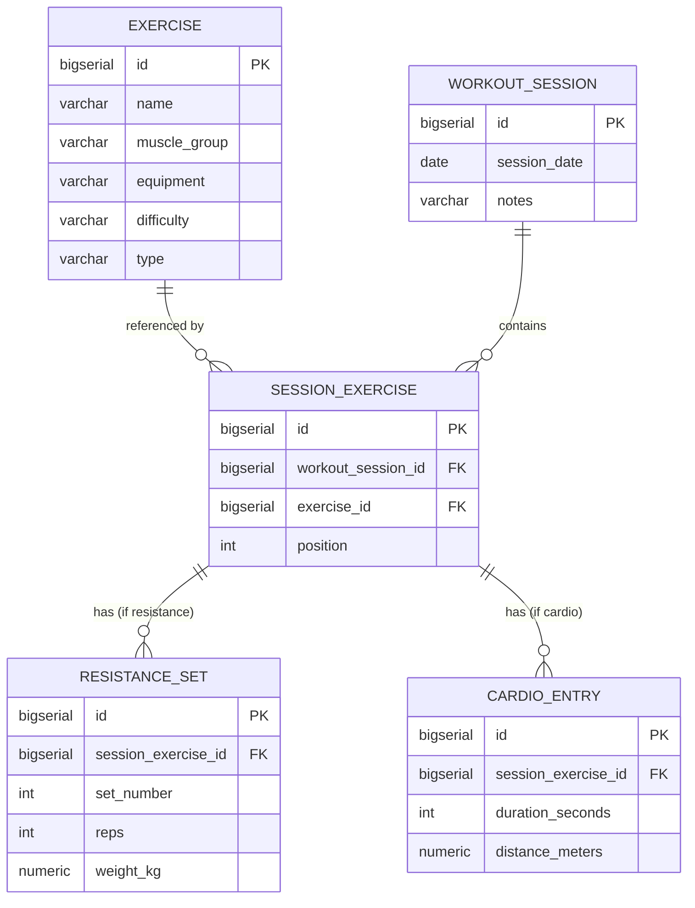

```mermaid
erDiagram
  EXERCISE ||--o{ SESSION_EXERCISE : "referenced by"
  WORKOUT_SESSION ||--o{ SESSION_EXERCISE : contains
  SESSION_EXERCISE ||--o{ RESISTANCE_SET : "has (if resistance)"
  SESSION_EXERCISE ||--o{ CARDIO_ENTRY : "has (if cardio)"

  EXERCISE {
    bigserial id PK
    varchar name
    varchar muscle_group
    varchar equipment
    varchar difficulty
    varchar type
  }
  WORKOUT_SESSION {
    bigserial id PK
    date session_date
    varchar notes
  }
  SESSION_EXERCISE {
    bigserial id PK
    bigserial workout_session_id FK
    bigserial exercise_id FK
    int position
  }
  RESISTANCE_SET {
    bigserial id PK
    bigserial session_exercise_id FK
    int set_number
    int reps
    numeric weight_kg
  }
  CARDIO_ENTRY {
    bigserial id PK
    bigserial session_exercise_id FK
    int duration_seconds
    numeric distance_meters
  }
```

